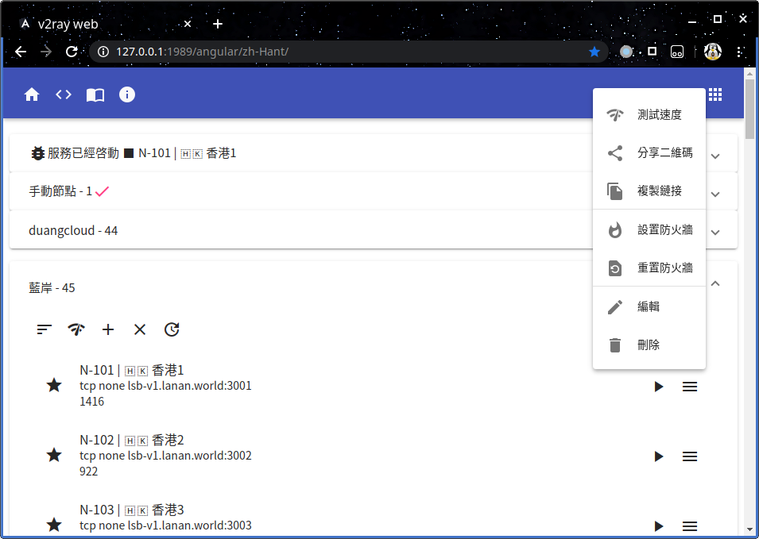
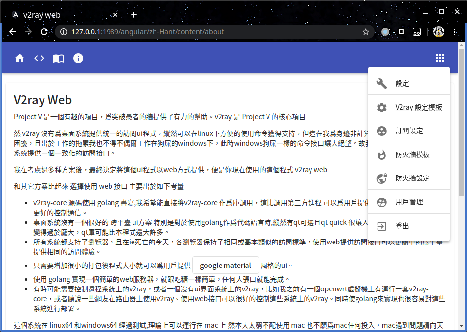
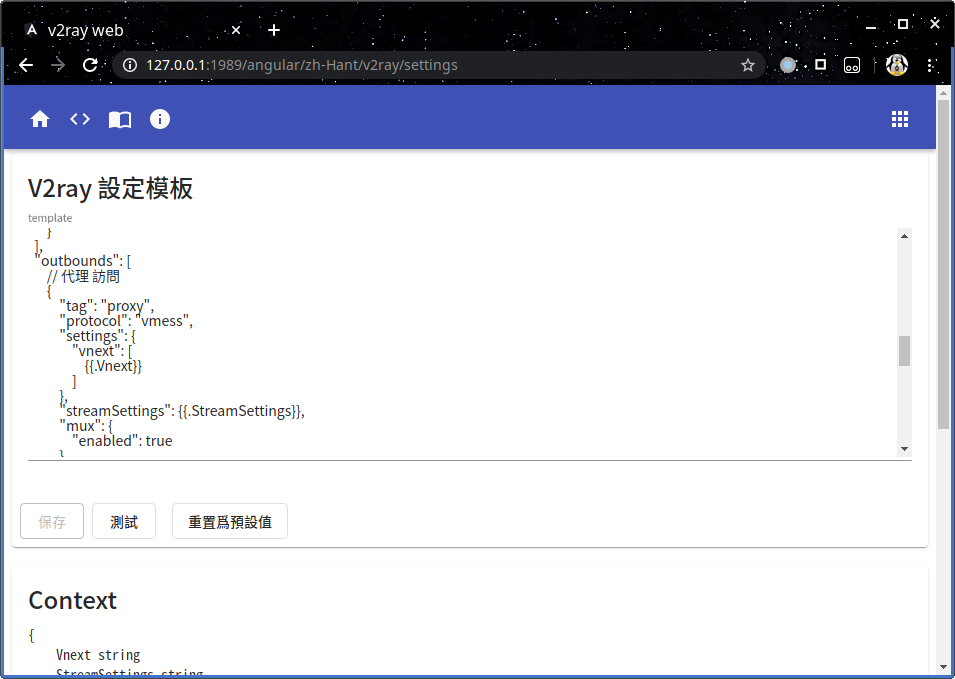

# v2ray-web

v2ray-web 是 v2ray-core 的一個 web接口的 ui程序 爲桌面系統提供了一個 簡單且一致的 操作方案

# 安裝與運行

[下載](https://gitlab.com/king011/v2ray-web/-/releases) 各平臺對應的 壓縮包 並解壓

執行 v2ray-web web 指令 運行程式

打開瀏覽器 訪問 http://127.0.0.1:1989 控制v2ray-core

# 預覽

